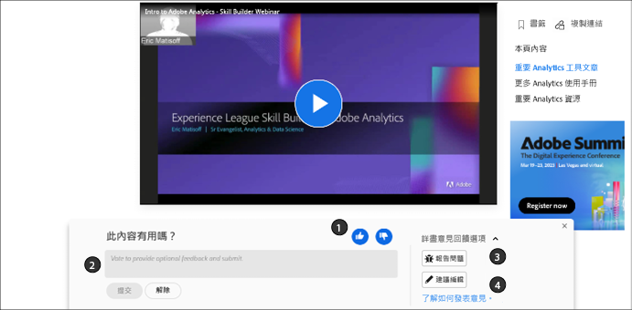
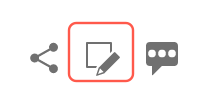
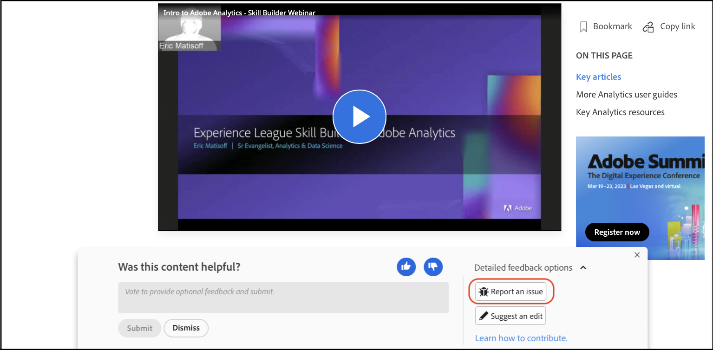

# Adobe 說明文件的貢獻者指南

本指南介紹您如何能夠為 Experience League 上的 Adobe 企業說明做出貢獻。

## 什麼是協作文件?

Adobe Experience Cloud 和其他 Adobe Enterprise 產品的技術文件和培訓內容是根據使用 GitHub、Markdown 和 Adobe Experience Cloud 解決方案的開放原始碼原則。

此開放原始碼模型改善了內容品質，以及客戶、文件團隊和產品團隊間的溝通。現在，在每個頁面上，您可以對內容實用程度進行評分、登錄問題，甚至以 Git 提取請求 (PR) 的形式貢獻內容建議。Adobe 文件團隊會每天監控貢獻內容和問題，並視需要進行更新、調校和調整。

## 使用協作文件

無論您是員工、合作夥伴、客戶或甚至是潛在客戶，身為此資料的使用者，您便可以選擇透過多種簡單的方式為此文件貢獻內容。

* 對頁面的實用程度進行評分 ❶，並留下評論 (選填) ❷
* 針對特定頁面回報問題 (需要 Git 登入)
* 提交快速編輯內容、撰寫整篇文章、提供完整的資產和程式碼範例 (需要 Git 登入)

這些選項會在頁面開啟幾秒鐘後出現在頁面底部。如果關閉意見回饋區域，您可以重新載入頁面以將其恢復。

本指南概述在與此資料集進行互動及貢獻內容時，所須瞭解的一切相關事項。

<!--
>[!IMPORTANT]
>All repositories that publish to docs.adobe.com have adopted the [Adobe Open Source Code of Conduct](../code-of-conduct.md) or the [.NET Foundation Code of Conduct](https://dotnetfoundation.org/code-of-conduct). For more information, see the [Contributing](../contributing.md) article.
>
> Minor corrections or clarifications to documentation and code examples in public repositories are covered by the [Adobe Documentation Terms of Use](https://www.adobe.com/legal/terms.html). New or significant changes generate a comment in the pull request, asking you to submit an online Contribution License Agreement (CLA) if you are not an employee of Adobe. We need you to complete the online form before we can review or accept your pull request.
-->

## 對頁面的實用程度進行評分，並留下評論 (選填)

您開啟頁面幾秒鐘後，頁面底部會出現意見回饋區域。按一下向上或向下鍵以表示頁面是否實用。

請隨時留下評論以提供更多意見回饋。

## 快速編輯現有文件

如果您想提供更詳細的意見回饋，進行快速編輯是修正文件小錯誤和遺漏的好方法。當您提出編輯建議時，您可以提交提取請求 (PR)，將修正/建議提交給我們，我們會接手審查這些建議，核准後正式發佈。

1. 若可接受，請簽署[貢獻者授權合約 (CLA)](http://opensource.adobe.com/cla.html)。

   您只須提交 Adobe CLA 一次。

1. 在文章底部的意見回饋區域中，按一下&#x200B;**[!UICONTROL 詳細的意見回饋選項]**，然後按一下&#x200B;**[!UICONTROL 建議編輯]**&#x200B;前往 GitHub 的 Markdown 來源檔案。

   

1. 按一下鉛筆圖示即可編輯文章。

   >[!NOTE]
   >
   >若鉛筆圖示呈現灰色狀態，表示您需登入 GitHub 帳戶或建立新帳戶。

   

1. 在網頁編輯器中變更內容。

   您可以按一下&#x200B;**[!UICONTROL 預覽變更]**&#x200B;標籤，檢查所做變更的格式設定。

1. 在進行變更後，請捲動至頁面底部。

   輸入 PR 的標題和說明，然後按一下&#x200B;**[!UICONTROL 提出檔案變更]**，如下圖所示：

   

   >[!NOTE]
   >
   >如果您收到有關簽署貢獻者授權合約 (CLA) 的驗證錯誤訊息，請按一下 **[!UICONTROL Details]** (詳細資料) 以開啟授權合約。若可接受，請簽署合約。接著，關閉並開啟提取請求，然後繼續進行。

這就是快速編輯的所有步驟。文件團隊成員會審核及合併您的提取請求。感謝您！

## 回報問題

要告訴我們某些內容有問題，另一簡單的方法是使用&#x200B;**[!UICONTROL 回報問題]**&#x200B;功能。

1. 在文章底部的意見回饋區域中，按一下&#x200B;**[!UICONTROL 詳細的意見回饋選項]**，然後按一下&#x200B;**[!UICONTROL 回報問題]**&#x200B;前往 GitHub 的 Markdown 來源檔案。

   

   >[!NOTE]
   >
   >若要回報問題，您必須登入 GitHub 帳戶，或建立帳戶。

   按一下此連結即可使用 Github 問題介面，快速向 Experience League 登錄票證。

   說明欄位會自動填入問題頁面的 URL。

1. 填寫問題的標題和簡短說明，然後按一下&#x200B;*「提交新問題」*。

   

提交問題會通知此頁面的內容團隊，以便他們解決您的問題。我們更新內容後，系統會透過 Github 問題介面通知您，且 Github 問題介面也會在更新或關閉時透過電子郵件通知您。

## 瞭解 GitHub 權限

GitHub 編輯 UI 會隨著您的存放庫權限適度調整。前述影像適用於沒有目標存放庫寫入權限的貢獻者。GitHub 會在帳戶中自動建立目標存放庫的複本。若您擁有目標存放庫的寫入權限，GitHub 會在目標存放庫中建立新分支。

Adobe 會對所有變更使用提取請求，即使是具備寫入權限的貢獻者亦然。大部分的存放庫都會保護 `main` 分支，因此您必須以提取請求的方式提交更新。

瀏覽器內編輯體驗最適合微幅或不頻繁的變更作業。若您做出重大貢獻或使用進階 Git 功能，建議您[建立存放庫複本並在本機作業](setup/full-workflow.md)。

## 提供意見反應

有了與 Adobe 解決方案一樣大型的解決方案，文件永遠都會是正在進行中的工作。一旦發現錯誤，請登錄問題；如對資料有任何建議，請通知我們。告訴我們您想尋找的資訊。若您找不到需要的內容，請通知我們；若您無法順利完成工作，請告訴我們該如何提供協助，以便您能瞭解我們的解決方案。

協作文件團隊以及 Experience League 中所有撰文人員和內容製作者在此感謝您的配合。
