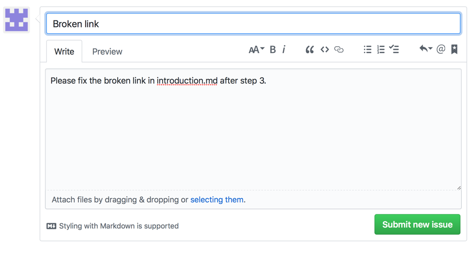

# Adobe文件的參與者指南概觀

## 甚麼是協作文件

在2019年，Adobe Experience Cloud的所有技術文件和啓用內容都將轉變為新平台，以開放原始碼原則為基礎，並採用Github、Markdown和Adobe Experience Cloud解決方案，包括Adobe Experience Manager、Analytics、Launch和Target。

此開放原始碼模型改善了客戶、文件團隊和產品團隊之間的內容品質。在每個頁面上，您現在可以對內容有用、記錄問題，甚至還可以貢獻內容建議作為Git提取請求(PRS)。Adobe文件團隊會每天監控貢獻和問題，並視需要進行更新、調整和調整。

## 使用協作文件

身為此類資料的使用者-不論您是員工、合作夥伴、客戶或潛在客戶-您都可以透過幾種簡單的方式對文件做出貢獻；

* 提高頁面的協助度
* 記錄特定頁面的問題
* 甚至可以快速編輯整個文章，其中包含資產和程式碼範例

本指南概述您所需的一切，以便瞭解與貢獻此資料集的資訊。

<!--
> [!IMPORTANT]
> All repositories that publish to docs.adobe.com have adopted the [Adobe Open Source Code of Conduct](../code-of-conduct.md) or the [.NET Foundation Code of Conduct](https://dotnetfoundation.org/code-of-conduct). For more information, see the [Contributing](../contributing.md) article.
>
> Minor corrections or clarifications to documentation and code examples in public repositories are covered by the [Adobe Documentation Terms of Use](https://www.adobe.com/legal/terms.html). New or significant changes generate a comment in the pull request, asking you to submit an online Contribution License Agreement (CLA) if you are not an employee of Adobe. We need you to complete the online form before we can review or accept your pull request.
--->

## 快速編輯現有文件

快速編輯是指修正文件小錯誤和疏漏的好方法。若文章顯示編輯按鈕 (如下所示)，表示您可自行快速修正。編輯文件時，您可以提交提取請求 (PR)，將修正/建議提交給我們，我們會接手審查這些建議，核准後正式發佈。

1. 簽署 [參與者授權合約(CLA)](http://opensource.adobe.com/cla.html) 。

   您只需要提交Adobe CLA一次。
1. 按一下右側欄中的 ** (編輯此頁面)，即可前往 GitHub 的 Markdown 來源檔案。`Edit this page`**
1. 按一下鉛筆圖示以編輯文章。

   > [!NOTE]
   > 若鉛筆圖示呈現灰色狀態，表示您需登入 GitHub 帳戶或建立新帳戶。

   

1. 在網頁編輯器中變更內容。您可以按一下 **Preview changes** (預覽變更) 標籤，檢查變更的格式設定。
1. 完成變更後，請捲動至頁面底部。輸入 PR 的標題和說明，然後按一下 **Propose file change** (提出檔案變更)，如下圖所示:

   

   >[!NOTE] 如果您收到有關簽署「參與者授權合約」(CLA)的驗證錯誤訊息，請按一下 **「詳細資料」** 以開啓授權合約。簽署合約(如適用)。然後關閉和開啓提取要求，然後繼續。

這就是快速編輯的所有步驟。感謝支持! 文件團隊成員會審核及合併您的提取請求。

## 登錄問題

另一種告訴我們內容有問題的簡單方法是「登錄問題」。

1. 若發現內容有問題，請按一下任何頁面右下角的 `Log an Issue` (登錄問題) 連結。請參閱下圖:

   

   > [!NOTE]
   > 您需要登入 GitHub 帳戶或建立新帳戶才能登錄問題。

   按一下此連結即可使用 Github 問題介面，快速登錄工單。

1. 說明欄位會自動填入問題頁面的網址。填寫問題的標題和簡短說明，然後按一下 *Submit new issue* (提交新問題)。

   

提交期刊時，將會直接通知這個頁面的內容團隊，他們將能夠採取行動。我們更新內容後，系統會透過 Github 問題介面通知您，且 Github 問題介面也會在更新或關閉時透過電子郵件通知您。

## 瞭解 GitHub 權限

GitHub 編輯 UI 會隨著您的存放庫權限適度調整。前述影像適用於沒有目標存放庫寫入權限的貢獻者。GitHub 會在帳戶中自動建立目標存放庫的複本。若您擁有目標存放庫的寫入權限，GitHub 會在目標存放庫中建立新分支。

Adobe 會對所有變更使用提取請求，即使是具備寫入權限的貢獻者亦然。大部分的存放庫都會保護 `master` 分支，因此您必須以提取請求的方式提交更新。

瀏覽器內編輯體驗最適合微幅或不頻繁的變更作業。若您做出重大貢獻或使用進階 Git 功能，建議您[建立存放庫複本並在本機作業](setup/full-workflow.md)。

## 提供意見反應

有了與 Adobe 解決方案一樣大型的解決方案，文件永遠都會是正在進行中的工作。一旦發現錯誤，請登錄問題；如對資料有任何建議，請通知我們。告訴我們您想尋找的資訊。若您找不到需要的內容，請通知我們；若您無法順利完成工作，請告訴我們該如何提供協助，以便您能瞭解我們的解決方案。

協作文件團隊及 [!UICONTROL Adobe Experience Cloud] 所有撰文人員和內容製作者在此感謝您的配合。
