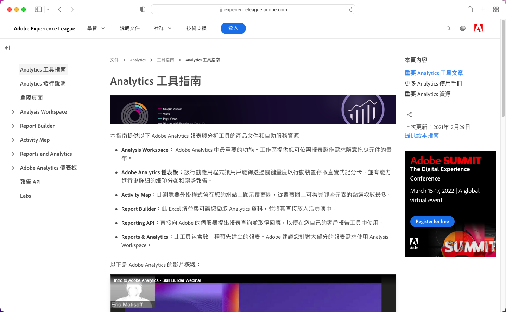

# Language Support for Adobe Experience Cloud Product Documentation

Adobe recognizes that you rely on product documentation, help, and support content to be readily available in languages supported by Adobe products. 為達成此目標，Adobe提供獨特的翻譯體驗，讓您選擇所選的語言，並就翻譯內容的品質提供意見回應。

## 選擇語言

您可以檢視大部分語言版本的Adobe Experience cloud產品檔案。

1. 導覽至Experience cloud產 [品檔案](https://helpx.adobe.com/support/experience-cloud.html)。

1. 瀏覽以尋找說明頁面(例如 [Analytics](https://docs.adobe.com/content/help/en/analytics/landing/home.html))。

1. 按一下「語言選擇器」（世界圖示），然後選擇語言。

   

   頁面會以您選取的語言顯示。

   

   若您尚未提供語言版本，Adobe可自動翻譯您的內容。 Adobe的自動翻譯服務會在頁面頂端的藍色欄位中顯示訊息：

   

   內容可能會自動以您的語言呈現，或者您可以按一下連結來觸發翻譯。 (當您按一下超連結從翻譯的頁面返回英文來源時，可能會發生此情形。 它提供您隨選檢視翻譯頁面的選項。)您隨時都可以回到英文來源。

   有時，英文來源內容可能會在翻譯完成之前，最近更新並發佈。 在下拉式選單中按一下您的語言後，您會看到通知： 在頁面頂部的淺藍色水準條中— 通知頁面已自動從舊版翻譯，更新內容即將推出。 您可以選擇在新的瀏覽器視窗中檢視最新的英文來源內容。

## 為何使用自動翻譯

Adobe運用自動轉譯功能，以多種語言發佈產品支援內容，盡可能縮短內容建立時間。 由於支援內容對產品使用至關重要，因此我們優先考慮由專業人員翻譯內容，但我們也可能會選擇自動翻譯，因為速度和緊急性最為重要。

Automatic translation is ubiquitous on the internet and its usage is generally accepted as a powerful information-gathering tool. 知識庫內容被廣泛採用，人為干預可能很少，甚至沒有。 Although there have been major technological breakthroughs in recent years, automatically-generated translations may contain occasional inaccuracies and errors in language and meaning.

### 透過瀏覽器自動翻譯

如果您已將瀏覽器偏好設定設為自動將任何頁面翻譯成您的語言，請注意，產生的翻譯結果會與透過Adobe頁面取得的翻譯結果不同。 這是因為瀏覽器提供的服務可能是書庫翻譯，而Adobe翻譯將會自訂，以符合Adobe樣式准則和術語。 為獲得最佳的自動翻譯結果，建議您在瀏覽器偏好設定中停用此特定網站的瀏覽器選項，或在顯示時按一下「 **Never translate** 」（永不翻譯）。

### 已知問題

You might occasionally experience issues with the automatic translation output, such as incomplete translations, corrupted characters or page layout issues. These are caused by any of the various authoring, publishing, or translation technology tools Adobe uses. We will make every effort to list the known issues here
below.

| **ISSUE ID** | **說明** | **狀態** |
|--------------|-------------------------------------------------------------------------------------|------------|
| G11N3558 | 有些Audience manager頁面是半英文和半翻譯（法文、西班牙文）。 | 開啟 |

### 意見反應

每當內容自動翻譯時（依預設或使用者動作），就有選項可針對翻譯提供意見回饋給Adobe。 In the
light-blue horizontal bar at the top of the page, you may answer “Yes” or “No” to the question, “Was this translation useful?”. Adobe collects this valuable
metric and analyzes the compiled data in order to make decisions about content translation. 我們重視您的意見回饋，鼓勵您回應。

未來，我們計畫讓您以記錄問題、提出改進建議，甚至要求使用其他語言等形式，提供更廣泛的意見回應。 Some of these features are already available on the English pages. In the long run, we believe this will help Adobe improve the user
experience on these pages.

