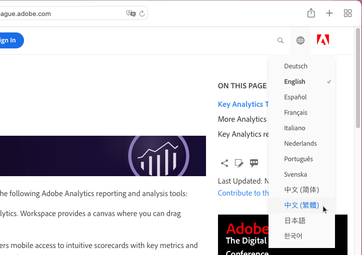

# Adobe Experience Cloud 產品文件的語言支援

Adobe 知道您仰賴 Adobe 產品支援語言版本的產品文件、說明和支援內容。為實現此目標，Adobe 提供獨特的翻譯體驗，讓您能選取所選的語言，並針對翻譯內容品質提出意見反應。

## 選取語言

您可以檢視大部分語言版本的 Adobe Experience Cloud 產品文件。

1. 請導覽至 Experience Cloud [產品文件](https://helpx.adobe.com/tw/support/experience-cloud.html)。

1. 瀏覽找到說明頁面 (例如 [Analytics](https://docs.adobe.com/content/help/zh-Hant/analytics/landing/home.html))。

1. 按一下「語言選取器」(世界圖示)，然後選擇語言。

   

   頁面會以您選取的語言顯示。

   

   若尚未提供您的語言版本，Adobe 可能會自動翻譯您的內容。Adobe的自動翻譯服務會在右導覽的頂端顯示訊息：

   

   內容可能會自動以您的語言顯示，或者，您可以按一下連結以觸發翻譯。(當您按一下超連結從翻譯的頁面返回英文來源頁面時，可能會發生此情形。這可讓您隨選檢視翻譯頁面。)您隨時都可以返回英文來源頁面。

   有時，英文來源內容可能最近剛更新，並在翻譯完成之前發佈。在下拉式選單中按一下您的語言後，您會看到通知 (位於頁面頂端的淺藍色水平列)，告訴您頁面自動以舊版翻譯，更新內容即將推出。想要的話，您可以選擇在新的瀏覽器視窗中檢視最新英文來源內容。

## 為何使用自動翻譯

Adobe 運用自動翻譯功能，以便在建立支援內容時，儘快發佈多種語言版本的內容。由於支援內容對使用產品而言至關重要，因此我們會優先使用由專業人員翻譯的內容，但我們也會在緊迫情況下選擇自動翻譯。

自動翻譯在網路上隨處可見，用途廣為人所接受，是功能強大的資訊收集工具。知識庫內容廣泛採用這項技術，幾乎不需人為干預。雖然近年來技術上有了重大突破，但自動產生的翻譯偶爾可能還是會出現語言和語意上的不精確和錯誤。

### 透過瀏覽器自動翻譯

如果您將瀏覽器偏好設定設為自動將所有頁面翻譯為您的語言，請注意，翻譯內容可能會與 Adobe 頁面上的內容不同。這是因為瀏覽器提供的服務可能是資料庫翻譯，而 Adobe 翻譯經過客製化，符合 Adobe 風格指南和術語。若要獲得最佳自動翻譯結果，建議您在瀏覽器偏好設定中，對此特定網站停用該瀏覽器選項，或在顯示時按一下&#x200B;**「一律不翻譯」**。

### 已知問題

您偶爾可能會遇到自動翻譯輸出的問題，例如翻譯不完整、字元損毀，或頁面版面問題。這些問題是因 Adobe 使用的各種編寫、發佈或翻譯技術工具所造成。我們會盡一切努力在下方列出已知問題。

| **問題 ID** | **說明** | **狀態** |
|--------------|-------------------------------------------------------------------------------------|------------|
| G11N3558 | 部分 Audience Manager 頁面一半是英文，一半是翻譯內容 (法文、西班牙文)。 | 未解決 |

### 意見反應

內容經自動翻譯後，無論是因預設設定或使用者動作，您都可以選擇向 Adobe 提供翻譯相關的意見反應。在頁面頂端的淺藍色水平列中，您可以針對「此翻譯對您是否有所幫助？」問題，回答「是」或「否」。Adobe 會收集這項寶貴量度並分析經編譯的資料，決定內容翻譯。我們重視您的意見反應，並歡迎您回應。

未來我們打算讓您可提供更廣泛的意見反應，如記錄問題、建議改善之處，甚至要求其他語言內容。英文頁面已提供上述部分功能。長遠來看，我們認為這有助於 Adobe 改善這些頁面的使用者體驗。

<!--

-->

### 譯文免責聲明

Adobe 會使用機器翻譯程式，將文字翻譯成多種不同語言。請注意，電腦翻譯通常為直譯，難免會有錯誤。Adobe 不保證所提供的翻譯正確無誤，譯文的可靠性和時效性也並非毫無疑慮。若因認定機器翻譯的資訊準確可靠而導致任何損失或損壞，Adobe 概不負責。如果英文和其他語言的版本之間有所差異，請以英文版為準。

若要回報翻譯錯誤或不準確之譯文，建議您直接與我們連絡。
