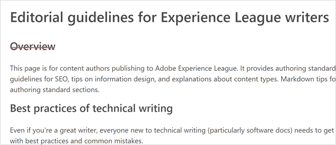
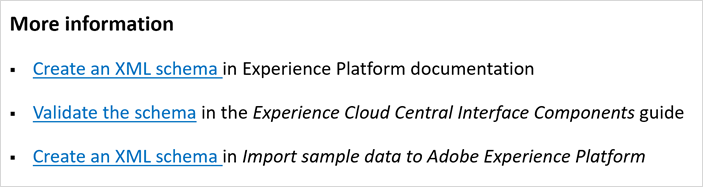
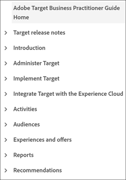

# 外部貢獻者寫作風格指南{#guidelines}

此頁面提供編輯指南，適用對象是為 Experience League 創作內容或更新現有內容的外部作者。在開始之前，請確保您符合下列條件：

* 熟悉 [Markdown](markdown.md) 撰寫作業
* 檢查文章的拼字與文法
* 使用友善語氣、一致的表述和簡單句子來改善機器翻譯
* 遵循本頁的[最佳實務](#writing-tips)和編輯標準

## 風格指南{#style-guidelines}

撰寫文件時，請謹記下列事項。

* **用詞精準**: 請勿堆疊贅字。務求言簡意賅。文章力求重點明確。盡量不要有太多註釋。
* **關照對象與目的**: 開始撰寫前，請先清楚判斷客戶身分，以及客戶希望達成的工作目標。撰寫文章以協助客戶完成工作。
* **適時舉例**: 提供例子來解釋概念。
* **組織內容**: 建立章節，將說明分成多個方便閱讀及理解的步驟。可使用螢幕截圖幫助理解。

## 技術寫作的最佳實務{#writing-tips}

技術寫作，特別是軟體文件，是一項專門行業。即使是產量豐富的小說家在嘗試技術寫作時也會感到不知所措——不是因為素材複雜或過度技術化，而是因為&#x200B;_簡化說明_&#x200B;複雜的技術資訊並不容易。若要成功寫作，您的內容必須在結構上保持一致、能夠快速瀏覽、可重複使用，且在發布管道中流通時不會出現結構和語法錯誤。

下列章節說明新作家必須注意的常見問題：

### 標題未以文字分隔 (雙標題){#double-headings}

如果您有兩個標題但沒有分隔兩者的文字，請加入缺少的文字 (以介紹第二個主題標題)。或者，您可以移除其中一個標題。第二個標題可能不是必要項目。

例如，_概觀_&#x200B;在這裡沒有任何用途：

* 此外，如果您的第二個標題剛好是&#x200B;_概觀_，則可能不是必要項目。第一標題 (H1) 和第一段落即可概要說明文章主題。

* 同樣地，以 SEO 用途來說，_概觀_&#x200B;和&#x200B;_簡介_&#x200B;這類自成一體的標題並不實用。提及您要介紹的產品或功能名稱。(範例：_流失報告概觀_)

### 交叉引用標題不一致{#maps}

使用&#x200B;_更多資訊_&#x200B;標題作為交互參照 (或地圖)。範例：

**交叉引用清單指南**

* 使用項目符號列出交叉引用內容
* 指南的正式名稱或頁面名稱使用斜體 (不使用連結文字時)
* 請勿在標題中使用標點符號
* 避免在標題中使用數字

### 比對目錄項目、階層連結和頁面名稱{#toc}

因為我們手動管理 TOC (目錄) 檔案，所以容易出現不相符的錯誤。確保目錄項目與頁面名稱 (H1) 相符。此外，請確保目錄項目與階層連結緊密相符。

**目錄和清單指南**

* 您可能需要縮短目錄項目，但項目必須與頁面名稱和階層連結明確相關。
* 階層連結是從標題中繼資料中提取，因此可以有所不同 (基於 SEO 用途)。

### 使用引號而非斜體{#quotes}

很難抗拒在字詞或片語周圍加上引號。但是，引號是用來引用演講的，幾乎從不會用於產品文件。

**引號指南**

* 通常，斜體比引號效果更好 (對於錯誤訊息、獨特或外文字詞等)。
* 針對介面元素，請使用粗體和 UICONTROL。

### 程序{#steps}

編寫程序 (_工作_&#x200B;內容類型) 並不是我們與生俱來的技能。建立明確可讀的程序需要練習。

**步驟指南**

* 程序是指一系列步驟。步驟是一個簡短、附編號的&#x200B;_單句_&#x200B;命令。
* 每個步驟以動詞或&#x200B;_不定式_&#x200B;作為開頭 (引導讀者了解目標，例如&#x200B;_若要保持登入狀態，請啟用「**保持登入狀態**_」)。如果某個步驟在整個程序中有特定目標，請在操作之前提及該目標。
* 如果您有該步驟的相關資訊 (稱作&#x200B;_步驟資訊_&#x200B;的內容類型)，請在這項資訊置入步驟後方 (與步驟縮進) 或資產後方 (螢幕擷圖、影片、或介面說明清單)。
* 如果步驟有兩個動作 (例如，_選擇這個，然後選擇那個_)，請將此步驟寫成一個簡短句子。
* 將工作限制在約七到十個步驟內。如果您為一項工作撰寫十個以上的步驟，則可能需要將其分成兩項工作。請善用您的判斷力。
* 在產品文件中，請勿使用標題作為步驟。(下列教學課程除外。)
* 針對多頁數教學課程，可允許將標題作為步驟。但是，請勿予以編號。請寫出&#x200B;_步驟 1：_、_步驟 2：_&#x200B;等。

**範例程序**

以下為適用於登入 Adobe 且寫作結構良好的程序：

若要登入 Adobe，請按照下列步驟操作：

1. 在 `Adobe.com` 中，選取 **Experience Cloud**。
1. 選取&#x200B;**登入**。
1. 選取&#x200B;**個人帳戶**。
1. 若要保持登入狀態，請選取&#x200B;**保持登入狀態**。
1. 輸入您的名稱和密碼。
1. 選取&#x200B;**登入**。

### 並行清單{#lists}

對清單使用並行結構，讓閱讀和快速瀏覽變得容易。清單包括 TOC (目錄)、項目符號 (無順序) 或編號清單。

包含並行項目的目錄範例：

前面的目錄是良好範例，因為：

* 概念性父項目是名詞或名詞片語
* 程序 (工作) 是主動動詞 (不是動名詞)
* 所有項目使用句子大寫格式

## 標題和說明中繼資料{#metadata}

_標題_&#x200B;和&#x200B;_說明_&#x200B;中繼資料對於 Experience League 上的 SEO、內容探索和內容品質分數至關重要。

以下是標題和說明的範例：

**概念文章的說明**

* _了解 Adobe Analytics 中的區段。獲取在工作區中設定區段面板的相關協助。_
* _查找在 Adobe Analytics 的頁面檢視報告中使用區段的相關協助。_

**程序/工作文章的說明**

* _瞭解如何在 Adobe Analytics 中建立區段。_
* _在 Adobe Analytics 中建立區段。了解如何根據您建立的區段選擇、設定和執行報告。_

您的作法取決於文章長度和範圍。

**概念文章的標題**

* _頁面檢視報告中的區段_

**程序/工作文章的標題**

* _為頁面檢視報告建立區段_

(請記得，管道和產品名稱會自動加入標題。)

## 提高清晰度 (和 Acrolinx 分數) 的方法{#tips}

以下是改進內容設計、清晰度和可讀性的簡單方法。這些方法也有助於提高 Acrolinx 風格分數和 ExL 上的 CQI 分數。

| 指南 | 關於 |
|---|---|
| 使用主動語態 | 將被動語態改為主動語態 |
| 使用現在時態 | **弱：***Campaign 第 8 版將於 6 月發布。* 
**強：***Campaign 第 8 版於 6 月發布。*
對於客戶來說，現在時態更容易閱讀。 |
| 避免使用弱且不必要的副詞 | *非常*、*極為*、*不可思議地*... 
副詞是額外的字詞，如果您使用強而有力且精確的動詞、子句和形容詞，這些副詞並不會增添任何重要意義。 |
| 對標題和[目錄項目](#using-toc)使用強動詞 | 範例：
**弱：***特徵建立與管理* 
**強：***建立和管理特徵* |
| 使用句子[大寫格式](https://docs.microsoft.com/en-us/style-guide/capitalization) | 如有疑問，請勿使用大寫。在標題中，使用句子大寫格式。專有名詞和冒號後的第一個字詞使用大寫。在程序中，根據實際介面使用大小寫。 |
| 了解這些小技巧就能提高清晰度 | <ul><li>避免&#x200B;*以便於* (這沒有增添任何意義)。你只需要使用&#x200B;*以*&#x200B;即可。</li><li>避免&#x200B;*運用。*&#x200B;這聽起來可能更具技術性，但事實並非如此。*運用*&#x200B;的意思是&#x200B;*善加利用，尤其是指那些不是為了所需目的但可以滿足需求*&#x200B;的事務。</li><li>避免使用分號：改用句號並開始一個新句子。分號會增加不必要的複雜性。</li><li>冒號：使用冒號來引入清單。在句子中請謹慎使用冒號。句子中冒號後的第一個字詞使用大寫。</li><li>使用牛津逗號 (清單中的三個逗號)。</li><li>將句子長度保持在 39 字以下。</li><li>導覽：使用&#x200B;_前往_&#x200B;或&#x200B;_造訪_。</li><li>除非顯示路徑是重要資訊，否則避免使用原始網址 (URL) 文字 (使用簡明的連結文字)。</li></ul> |
| 在 VSC 中使用拼寫檢查器 | 在 Visual Studio Code 中安裝 Code Spell Check (擴充功能)。 |
| 將&#x200B;_點選_&#x200B;改為&#x200B;_前往_&#x200B;或&#x200B;_選取_ | _點選_&#x200B;是與裝置相關的字詞 (可能有無障礙支援的問題)，現行趨勢是避免使用這類字詞。以下是更改建議：<ul><li>導覽：_前往檔案 > 列印_。</li><li>點選：_選取檔案 > 列印_&#x200B;或&#x200B;_選取確定_。 </li></ul>請參閱[說明 UI 互動](https://docs.microsoft.com/en-us/style-guide/procedures-instructions/describing-interactions-with-ui)，進一步了解在各種情況下最適合的字詞選擇。 |
| 在 VSC 中執行 Acrolinx | 針對風格和語法問題的 Acrolinx 檢查。Acrolinx 會檢查網址、術語和拼寫等。這有助您提高清晰度並改善 Experience League 內容的翻譯。 |

{style="table-layout:auto"}

更多最佳實務和資源：

* [可快速瀏覽的內容](https://docs.microsoft.com/en-us/style-guide/scannable-content/)：幫助讀者快速找到所需的內容，或者能夠快速地判斷他們是否在所需的位置。良好撰寫對快速瀏覽有所幫助。
* **數字：**&#x200B;在正文中，拼出從零到九的整數，10 (或更大) 則使用數字表示。請參閱[編號](https://docs.microsoft.com/en-us/style-guide/numbers)。
* 像說話一樣寫作，可表達友善態度並快速切入正題。

若要進一步了解，請參閱 [Microsoft® 風格指南](https://docs.microsoft.com/en-us/style-guide/welcome/)中的 [10 大寫作技巧](https://docs.microsoft.com/en-us/style-guide/top-10-tips-style-voice)。

## 替代文字{#alt-text}

在資產 (影像) 加入有意義的替代文字。考慮相符的替代文字：

* 客戶可以完成的目標 (工作或概念名稱)
* 顯示的功能或頁面
* 顯示的圖示名稱

Google 會考量 SEO 結果中的替代文字。

## 本地化 - DNL 和 UICONTROL{#localization}

您不需要擔心產品是否需要本地化或 ExL 使用的語言。但如果可以的話，您可以採用下列兩個 (必要的) Markdown 標記來幫助提升本地化品質：

* `DNL`

  DNL 是指&#x200B;_請勿本地化 (do not localize)_。您只會將其用於附有商標的 Adobe 產品名稱，這些名稱都必須保留英文。

  語法範例：`[!DNL Adobe Campaign]` 或 `[!DNL Workfront]`。

  DNL 不適用於檔案名稱或網址。

* `UICONTROL`

  UICONTROL 是指介面控制項 (例如 UI 中的選項、欄位、標籤、頁面、選項組或功能名稱)。

  語法範例：`Select **[!UICONTROL Project]**, then select **[!UICONTROL Save]**.`

>[!IMPORTANT]
>
>在本地化內容之前，您必須套用這些標籤。

### 在產品名稱中使用 Adobe{#product-names}

為了識別公司，我們通常在指南級別的產品的第一次引用中包含 _Adobe_。考量版面空間，您可以將 Adobe 放在標題中，但正文中的第一次引用應包括全名。部分產品，例如 _Adobe Audition_ 和 _Adobe Premiere Pro_，必須在第一個或最顯眼的引用中使用 Adobe，因為這是合法商標名稱的一部分。

## 文章第一段{#firstparas}

文章第一段應定義主題，並說明讀者可以從閱讀文章中學到什麼。

第一段範例 (概念)：

_對象是訪客的集合 (訪客 ID 的清單)。Adobe 的 Audience Service 可管理將訪客資料轉譯為對象區段的過程。因此，建立和管理對象類似於建立和使用區段，再加上可與 Experience Cloud 共用對象區段的能力。_

第一段範例 (工作)：

_建立客戶屬性來源 (CSV 和 FIN 檔案) 並上傳資料。您可以在準備就緒後啟動資料來源。在資料來源作用中後，將屬性資料共用至Analytics和Target。_

### 文章第一段的 SEO 技巧{#seo}

* 在第一段中包括搜尋字詞。
* 使用讀者使用的術語。
* 包括同義詞，如有必要，也納入術語的過往用法。例如，「Experience Cloud ID Service (ECID)，以前稱為&#x200B;_訪客 ID_，或縮寫如 MID、MCVID，這個永久通用 ID 可用來識別訪客。」
* 在連結中包含 SEO 術語。
* 避免將重要術語放在複雜的表格中。複雜表格不會產生可靠的搜尋結果。系統不會搜尋影像中的文字。系統會搜尋字幕。

## 大小寫{#capitalization}

* Adobe 風格針對所有主題、標題、副標題和頁面導航元素使用句子大寫格式。
* 除了第一個字詞和專有名詞 (例如品牌名稱、解決方案名稱和服務名稱)，所有字詞均使用小寫。
* 必須與產品名稱、工具、選項、選單項目、對話框和欄位的大小寫相符。

## 目錄{#using-toc}

`TOC.md` 是您的目錄。每個指南都會有一個。

**目錄 (TOC)** 的編輯指南

* 大寫：每個項目一律使用句子大小寫 (不包括首字母縮略詞)。只有正式的產品名稱或介面元素 (頁面、標籤、欄位、選項等) 需要使用大寫。引用時必須與 UI 相符。
* 動詞形式和排比：使用祈使動詞並避免動名詞。目錄是一種清單，因此在大多數情況下都會盡量使清單內容保持平行。有些例外情況有時是無法避免的。對於概念頁面，使用名詞和名詞片語。對於工作，使用動詞。

**語法指南**

* 目錄 (TOC) 中的章節標題 (父系) 不得為連結，因為其沒有包含內容的頁面。應該包含錨點，例如 `{#processing-rules}`。
* 您必須針對目錄章節標題 (例如 `+ Processing rules {#processing-rules}`) 和目錄文章連結 (例如 `+ [Article name](article.md)`) 使用正確語法。
* 目錄文章項目可以是文章標題的縮寫版本。請遵循本文件中概觀、概念和工作的撰寫標準。
* 避免將同一檔案多次加入一個目錄 (或多個目錄)。這樣做可能會發生錯誤。
* 如果您的存放庫包含多份使用手冊，則使用手冊目錄必須位於同一級別，例如 `help` 目錄中的子目錄。每個使用手冊目錄必須有一個 TOC 檔案。手冊目錄不可使用巢狀內嵌。

## 粗體和斜體{#bold}

* 僅針對程序中 (及包含 UICONTROL) 點選的介面元素使用粗體文字。
* 若需強調或避免混淆，請使用斜體文字。例如外來字詞，或者當您說明一個字詞或定義一個術語時。
